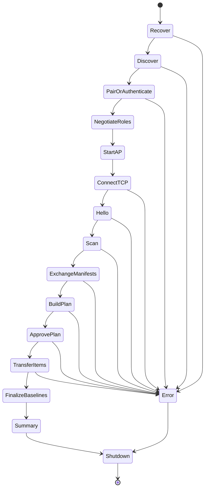

# CrossInk X3/X4 Device Sync Architecture

Status: implementation in progress on `v1.4.0-custom` from CrossInk `v1.4.0`.

Implemented foundation:

- Phase 0 host and simulator build blockers are repaired in the custom branch.
- `lib/AtomicFile` provides the first no-heap, callback-based old-or-new replacement primitive with host power-cut fault injection.
- Per-book `stats_v5.bin` is the first migrated store; bookmarks, clippings, progress, reader settings, JSON stores, journals, and Device Sync transport remain pending.

Target devices: Xteink X3 and X4 (ESP32-C3, no PSRAM, SD-backed storage).

## 1. Executive Summary

CrossInk should provide a first-class **Device Sync** flow that lets an X3 and X4 reconcile books and reading state without the user choosing a direction. Both readers enter **File Transfer > Device Sync**, discover each other, authenticate, negotiate policy, compare manifests, transfer only changed data, merge compatible state, preserve conflicts, and show continuous progress.

The primary design is intentionally not a whole-device copy and not a raw mirror of `/.crosspoint`. It has three layers:

1. **Discovery and secure transport**: ESP-NOW discovers the peer and negotiates roles; a temporary WPA2 Wi-Fi network and one authenticated TCP session carry manifests and data.
2. **Reconciliation**: category-specific adapters compare each side with the last acknowledged common baseline. Identical hashes are skipped. Unilateral changes propagate automatically. Concurrent changes are merged where semantics permit or preserved as conflicts where they do not.
3. **Per-file transactional apply**: every received or merged file is written to a staging file, synchronized, verified, and promoted with a recoverable journal and backup rename. The sync does not require enough free space for a second copy of the entire library; it requires space for only the largest file currently being replaced, plus bounded metadata and a safety reserve.

The feature must be **idempotent**. Retrying after a dropped connection, reset, power failure, or lost acknowledgement must either complete the same operation or report that it was already committed. A partial session is valid: successfully committed items stay committed, uncommitted items resume or retry next time, and the common baseline advances only per acknowledged item.

The recommended first release is state sync plus whole-file content sync with full-file SHA-256 comparison and resumable sequential transfer. Rsync-style block delta transfer is a later optimization; it is not required to skip identical files and would substantially increase RAM, disk-I/O, protocol, and recovery complexity.

## 2. Goals

The design must satisfy these goals:

- Put both devices in one automatic mode and converge their permitted data without selecting `Sync To` or `Sync From`.
- Support X3 and X4 interchangeably even when screen-specific assets and preferences differ.
- Never modify an authoritative destination file before a complete replacement has been received and verified.
- Recover deterministically after power loss at every write, sync, close, rename, remove, and acknowledgement boundary.
- Resume interrupted large-file transfers without restarting from byte zero when the staged data is valid.
- Skip identical files and unchanged semantic records.
- Avoid loading a complete library manifest, file, or block-hash table into RAM.
- Bound every network wait and every activity state; no infinite wait is a valid state.
- Keep rendering responsive and show stage, item, byte, retry, throughput, and ETA progress.
- Let each device independently configure what it may send and what it may receive.
- Keep secrets, generated caches, and device-specific state out of sync unless a category explicitly supports them.
- Merge cumulative reading statistics without double counting data already exchanged in earlier sessions.
- Preserve both versions whenever an automatic semantic resolution would lose user-authored content.
- Remain compatible with both the X3 and X4 HAL and activity lifecycle.

## 3. Non-Goals

The initial implementation should not attempt these:

- Continuous background synchronization while reading.
- Internet/cloud relay.
- Multi-device consensus beyond paired-device metadata that can later be generalized.
- In-place modification of book files.
- Mirroring generated EPUB layout caches.
- Silent propagation of content deletions by default.
- Treating FAT modification time as an authoritative ordering clock.
- Resolving an inherently ambiguous concurrent progress conflict without a documented policy and preserved recovery data.
- Implementing the complete rsync rolling-checksum algorithm in the first release.

## 4. Existing CrossInk Foundations

The design should extend existing mechanisms rather than create parallel infrastructure.

### 4.1 File Transfer activity routing

`NetworkModeSelectionActivity` is already the File Transfer mode menu. It currently exposes four choices and returns a `NetworkMode` result (`src/activities/network/NetworkModeSelectionActivity.cpp:11-44`, `src/activities/network/NetworkModeSelectionActivity.cpp:60-88`).

`CrossPointWebServerActivity` routes Nearby Stats Sync to a dedicated activity and routes the other choices into STA/AP/Calibre flows (`src/activities/network/CrossPointWebServerActivity.cpp:132-190`). `ActivityManager` already has direct wrappers for these flows (`src/activities/ActivityManager.cpp:189-210`). A dedicated `DeviceSyncActivity` is therefore consistent with the current activity model.

### 4.2 Existing peer discovery

Nearby Stats Sync and Nearby Position Sync already use ESP-NOW, device MAC identity, small packets, bounded retry intervals, and activity-owned radio lifecycle (`src/activities/network/NearbyStatsSyncActivity.cpp:78-126`, `src/activities/network/NearbyStatsSyncActivity.cpp:190-220`; `src/activities/reader/NearbyBookPositionSyncActivity.cpp:557-623`).

Nearby Position Sync already serializes a compact, document-identified EPUB position containing percentage, spine, page, paragraph/list anchors, and XPath (`src/activities/reader/NearbyBookPositionSyncActivity.cpp:441-515`). That representation is a useful starting point for a versioned progress adapter.

### 4.3 Existing network transfer primitives

CrossInk already supports Wi-Fi STA and AP modes (`src/activities/network/CrossPointWebServerActivity.cpp:168-225`) and has streaming download/upload code. `HttpDownloader` supports HTTP range resume and bounded buffers (`src/network/HttpDownloader.cpp:421-535`). WebSocket upload reports byte progress, but currently writes directly to the destination path (`src/network/CrossPointWebServer.cpp:1640-1740`). The existing generic upload handlers must not be reused as the transactional Device Sync apply path.

WebDAV already stages PUT data to `*.davtmp`, but removes the old destination before promotion and does not sync and verify the staged file (`src/network/WebDAVHandler.cpp:60-128`). It demonstrates the right staging direction but not the full durability contract required here.

USB file transfer already computes a streaming CRC and uses a temporary upload path, but removes the old destination before rename (`src/network/UsbSerialFileTransfer.cpp:320-460`). Device Sync must use a stronger transaction sequence.

### 4.4 Existing file identity and hashing

KOReader progress uses a partial-content MD5 document identity built from 1 KiB samples at selected offsets (`lib/KOReaderSync/KOReaderDocumentId.cpp:34-91`). This is useful for compatibility and candidate matching, but it is not a full-file integrity hash and must not authorize skipping or promotion.

The pinned Arduino-ESP32 3.3.7 framework contains streaming `SHA256Builder` support. The local ESP32-C3 framework also contains mbedTLS SHA-256, Curve25519, HKDF, AES, and GCM support. Implementation must compile-probe these exact APIs before the protocol format is frozen.

Font downloads already use size plus CRC32 to skip existing files and verify downloads (`src/activities/settings/FontDownloadActivity.cpp:464-476`, `src/activities/settings/FontDownloadActivity.cpp:602-694`). Device Sync should generalize the same concept with SHA-256 for content identity and integrity.

### 4.5 Existing transactional writes

EPUB progress already follows `temp -> sync -> close -> old to backup -> temp to final -> restore backup on failure` (`src/activities/reader/EpubReaderUtils.h:66-133`). Global stats use the same pattern and verify the staged file size (`src/activities/reader/GlobalReadingStats.cpp:189-266`).

Other authoritative stores are weaker. Book stats write directly to the final file without short-write, sync, or backup handling (`src/activities/reader/BookReadingStats.cpp:242-274`). Bookmark files also write directly to the final path and do not check all writes (`src/BookmarkStore.cpp:529-556`). Clipping files check writes and call `sync()`, but still truncate the final file before the replacement is complete (`src/ClippingStore.cpp:232-273`). JSON settings/state/recent stores call `Storage.writeFile()` on the final path (`src/JsonSettingsIO.cpp:105-124`, `src/JsonSettingsIO.cpp:167-219`, `src/JsonSettingsIO.cpp:481-494`).

A reusable atomic-file helper and migration of every sync-authoritative writer are prerequisites for safe semantic merging.

### 4.6 Storage serialization boundary

All firmware storage operations pass through `HalStorage`/`HalFile`, whose methods serialize SD and shared-SPI access with a storage mutex (`lib/hal/HalStorage.cpp:119-163`, `lib/hal/HalStorage.cpp:211-310`). Device Sync must not use raw `FsFile`, SdFat, or SDK storage APIs outside the HAL.

The current HAL exposes file `sync()`, rename, seek, and 64-bit size/seek, but does not expose free-space queries, file truncation, or an explicit volume/directory metadata sync (`lib/hal/HalStorage.h:13-99`). The implementation must add and verify the minimum missing HAL methods before transfer code is written.

### 4.7 Existing persistent data

The current cache inventory includes settings, state, recent books, credentials, bookmarks, clippings, global stats, per-book progress/stats/settings, covers, thumbnails, metadata, CSS, and laid-out sections (`docs/data-cache.md:12-47`). Cache identity is path-based (`docs/data-cache.md:58-62`), so raw cache-directory copying is unsafe when book paths differ.

## 5. Safety Invariants

These are hard requirements, not preferences.

| ID | Invariant |
|---|---|
| S1 | An authoritative destination is never opened with truncate while it is the only valid copy. |
| S2 | Received data is not eligible for promotion until expected length and SHA-256 both match. |
| S3 | Every promotion has enough durable metadata to choose complete, rollback, or retain safely after reboot. |
| S4 | A failed or cancelled transfer leaves the previous authoritative file readable. |
| S5 | A lost acknowledgement may cause a retry, but never a duplicate semantic increment. |
| S6 | Baseline metadata advances only after the receiver has durably committed and both peers have acknowledged the item result. |
| S7 | Every protocol message carries protocol version, session ID, monotonic sequence number, length, and authentication. |
| S8 | Duplicate and out-of-order messages are rejected or answered idempotently. |
| S9 | No network callback or ESP-NOW callback performs SD I/O, rendering, allocation, or blocking lock acquisition. |
| S10 | At most one source file and one destination staging file are open per device during a content transfer. |
| S11 | Every loop wait has a deadline, retry limit, and explicit error transition. |
| S12 | Paths are normalized and checked against policy before any filesystem operation. `..`, control characters, protected roots, and sync-internal names are rejected. |
| S13 | Derived caches never overwrite user-authored data and are never required for session success. |
| S14 | Device-local secrets are never included by an `Everything` preset. |
| S15 | Concurrent user-authored content is preserved; automatic conflict handling may select a visible winner but may not discard the loser. |
| S16 | Merge operations are deterministic, idempotent, and tested for commutativity where their data type permits it. |
| S17 | On low storage, the session stops before receiving bytes that cannot be promoted safely. |
| S18 | Sync exits close all files and radio/network objects in reverse acquisition order. |
| S19 | A session can be resumed only when peer identity, session/transfer identity, path, expected size, and expected hash match the staged journal. |
| S20 | Sync settings are device-local policy and cannot be changed by the peer during sync. |

### 5.1 Failure-model boundary

The software target is old-or-new recovery for every Device Sync mutation, but the guarantee has a hardware boundary. FAT on removable SD media has limited sudden-power-loss resilience, and an SD controller or damaged card can corrupt sectors or directory metadata outside the bytes the firmware intended to change. No application-level journal can guarantee recovery from arbitrary controller, card, or whole-filesystem failure.

The implementation therefore assumes:

- The card returns write/sync/close errors when it detects them.
- A successful `sync()` means the card accepted the data, subject to the card's own firmware and power-loss behavior.
- Rename and volume metadata behavior will be characterized on both X3 and X4 backends before release.
- User-authored data still needs ordinary backups for physical card failure.

Within that boundary, every injected software reset, connection loss, short write, reported SD error, and power cut at a tested operation boundary must recover to a valid old or new item without silently inventing success.

## 6. User Experience

### 6.1 File Transfer menu

The recommended top-level menu is:

```text
File Transfer
  Join Network
  Calibre Wireless
  Create Hotspot
  Device Sync
  Nearby Stats Sync
```

`Device Sync` opens:

```text
Device Sync
  Auto Sync With Device
  Sync Settings
  Paired Devices
  Recovery / Pending Transfers   (only when relevant)
  Advanced One-Way Session       (optional expert fallback)
```

Automatic bidirectional reconciliation is the default. `Sync To` and `Sync From` remain useful as advanced recovery modes, but they should not define the core data model. Direction is derived per item from each device's current state, common baseline, and policy.

### 6.2 Normal session

1. The user opens **Auto Sync With Device** on both readers.
2. The readers discover each other over ESP-NOW.
3. First-time peers show matching device names and a short authentication code; both users confirm.
4. Previously paired peers authenticate automatically.
5. The devices negotiate a temporary network and connect.
6. Both scan permitted categories and display hashing progress.
7. Both exchange manifests and compute one deterministic reconciliation plan.
8. The UI displays counts: unchanged, upload, download, merge, conflict, blocked-by-policy.
9. Transfers and semantic merges run item by item.
10. The final screen reports committed, skipped, merged, conflicted, deferred, and failed items.
11. The network is shut down and the firmware performs the existing intentional restart used after radio-heavy flows.

### 6.3 Cancellation

Pressing Back requests cancellation; it does not kill the activity immediately.

- During discovery, scanning, and planning, cancellation can stop immediately after the current bounded operation.
- During a file chunk, cancellation stops after the current chunk is synchronized or discarded.
- During promotion, cancellation is deferred until the transaction reaches a recoverable terminal state.
- The UI must say `Finishing current file safely...` while cancellation is deferred.
- Staged resumable data may be retained according to the cleanup policy.

### 6.4 Progress display

Every screen must show an active stage and evidence of movement.

Recommended fields:

| Field | Example |
|---|---|
| Stage | `Hashing`, `Comparing`, `Receiving`, `Verifying`, `Applying`, `Waiting`, `Recovering` |
| Item count | `Book 17 of 342` |
| Current item | `The Dispossessed.epub` |
| Byte progress | `18.4 MB / 31.2 MB (59%)` |
| Session progress | `127 / 342 items complete` |
| Throughput | `286 KB/s` |
| ETA | `about 44 s` |
| Liveness | `Peer active 1 s ago` |
| Retry | `Retry 2 of 5` |

E-ink updates must be throttled. Repaint when one of these occurs:

- Stage changes.
- Current item changes.
- Progress advances by at least 1%.
- At least 256 KiB more data is committed.
- Two seconds pass without another repaint.
- Retry/error/cancellation state changes.

The activity loop and network heartbeat continue independently of display refresh. Rendering must never hold a file or transport lock.

## 7. Global Sync Policy

Each device owns a policy file. The peer can inspect the effective policy but cannot modify it.

Each category has separate outbound and inbound permissions:

```text
Disabled
Send only
Receive only
Bidirectional
```

The effective permission for an A-to-B operation is:

```text
A allows outbound(category, path)
AND
B allows inbound(category, path)
AND
both support the category schema
```

### 7.1 Recommended defaults

| Category | Default | Reconciliation |
|---|---:|---|
| Book content: EPUB/XTC/TXT/Markdown | Bidirectional | Hash compare; preserve content conflicts |
| EPUB progress | Bidirectional | Three-way semantic merge |
| XTC/TXT progress | Bidirectional | Three-way semantic merge when compatible |
| Bookmarks | Bidirectional | Set merge plus tombstones |
| Clippings/highlights | Bidirectional | Set merge plus tombstones |
| Per-book portable reading options | Bidirectional | Field-aware merge |
| Per-book device-layout options | Disabled | Remain device-local |
| Reading stats | Disabled | Per-origin monotonic ledger when enabled |
| Finished/read state | Bidirectional | Semantic state register, not raw file copy |
| Recent books | Disabled | Optional ordered-set merge |
| Global reader preferences | Disabled | Field allowlist only |
| OPDS server definitions | Disabled | Optional; credentials excluded by default |
| SD font packages | Disabled | Raw immutable content by hash |
| Sleep images and sleep folder | Disabled | Explicit opt-in path category |
| Screenshots | Disabled | Explicit opt-in path category |
| Wi-Fi credentials | Never | Not syncable |
| KOReader credentials | Never | Not syncable |
| Device name/pair keys | Never | Not syncable |
| Render/layout caches | Never | Derived locally |
| Firmware/OTA files | Never | Not syncable |

### 7.2 Path rules

Content policy supports ordered include/exclude rules with normalized absolute paths. Defaults should include supported reader files under user-visible library folders and exclude hidden/system roots.

Example:

```text
include /**/*.epub
include /**/*.xtc
include /**/*.xtch
include /**/*.txt
include /**/*.md
exclude /.crosspoint/**
exclude /.fonts/**
exclude /fonts/**
exclude /.sleep/**
exclude /sleep/**
exclude /.crossink-stats-backup/**
exclude /**/.device-sync-*
```

Rules must be compiled into a bounded representation and evaluated during traversal. Do not keep an unbounded list of matched paths in RAM.

### 7.3 Portable versus device-layout settings

Raw `reader_settings.bin` must not be copied. Its current payload includes font, orientation, screen margin, image rendering, reading aids, and render mode (`docs/file-formats.md:86-138`). X3 and X4 may require different geometry and installed fonts.

The adapter should classify fields:

| Portable by default | Device-local by default |
|---|---|
| Hyphenation | Orientation |
| Paragraph alignment | Physical screen margin |
| Embedded style preference | Status-bar geometry |
| Bionic Reading | X3 tilt behavior |
| Guide Dots | Sleep-screen asset selection |
| Image display on/off | Font selection unavailable on receiver |
| Auto-page-turn interval | Render caches/page counts |

Font family and point size are conditional: sync them only if the receiving device has the family and size. Otherwise preserve the local value and report `portable setting unavailable`.

### 7.4 `Everything` meaning

`Everything` means all portable, user-authorized categories. It never means raw SD-card mirroring. It always excludes secrets, firmware, sync internals, generated caches, temporary files, and device-local settings.

## 8. Data Classification and Adapters

A central rule is: **sync logical data, not internal files, whenever a file embeds paths, version-specific layout, device geometry, or cumulative counters.**

| Data | Current storage | Sync representation | Raw copy allowed? |
|---|---|---|---:|
| Book content | User SD paths | Path + size + SHA-256 + content type | Yes, transactionally |
| EPUB progress | `epub_<path-hash>/progress.bin` | Document ID + percentage + spine/page + anchors | No |
| XTC/TXT progress | Format cache dirs | Versioned logical location | No |
| Bookmarks | `/.crosspoint/bookmarks/*.bin` | Stable bookmark records + tombstones | No |
| Clippings | `/.crosspoint/clippings/*.bin` | Stable clipping records + tombstones | No |
| My Clippings export | `/My Clippings.txt` | Derived from clipping records | No |
| Per-book stats | `stats_v5.bin` | Per-origin contribution records | No |
| Global stats | `global_stats.bin`, `synced_stats/` | Per-origin contribution records | No |
| Per-book settings | `reader_settings.bin` | Field-level portable settings | No |
| Recent books | `recent.json` | Optional bounded logical list | No |
| Global settings | `crossink-settings.json` | Explicit field allowlist | No |
| Wi-Fi/KOReader credentials | JSON files | None | Never |
| OPDS definitions | `opds.json` | Optional definitions without secrets | No |
| Fonts | `/.fonts` or `/fonts` | Immutable package files by SHA-256 | Yes |
| Sleep images | configured folder | Optional raw image files | Yes |
| Covers/thumbs/CSS/sections | EPUB cache | Derived | Never |
| `state.json` | mixed runtime/device state | No raw adapter | Never |

## 9. Device, Peer, Session, and Item Identity

### 9.1 Device identity

Use a stable 128-bit `DeviceId` derived once from the factory MAC plus a domain separator and persisted random salt. Do not expose the raw MAC as the protocol identity. The display name remains user-configurable and is not an identity key.

### 9.2 Pair identity

A pair record contains:

```text
protocol format version
peer DeviceId
peer display name
pair secret / key material
first-paired local generation
last successful session ID
capability snapshot
policy digest last observed
replay window / last accepted handshake counter
```

The pair record is device-local and written transactionally.

### 9.3 Session identity

Each attempt creates a random 128-bit `SessionId`. Every frame includes this ID. Reconnecting after transport loss may resume the same persisted session only when both peers agree on the ID and plan digest. Starting a fresh scan creates a new session but may adopt compatible staged transfers by content hash.

### 9.4 Logical item identity

Each manifest record has a category-specific `ItemId` independent of the destination cache path.

Recommended initial identities:

| Item | Item ID |
|---|---|
| Content path entry | SHA-256 of normalized sync-root ID + relative path |
| Content version | Full-file SHA-256 |
| EPUB logical state | Strong content SHA-256, plus KOReader ID as compatibility alias |
| Bookmark | Origin DeviceId + monotonic record counter; migrated records use deterministic payload hash |
| Clipping | Origin DeviceId + monotonic record counter; migrated records use deterministic payload hash |
| Stats contributor | Book ID + origin DeviceId |
| Portable setting | Book ID + field ID |
| Tombstone | Item ID being removed + causal version |

The content path and content hash are separate. Two paths containing the same bytes are two path entries that may reuse transfer data but are not silently collapsed.

### 9.5 Book identity limitations

The existing KOReader ID is only a partial MD5 and is not sufficient for integrity. Full SHA-256 is the authoritative content version. A future EPUB adapter may add the OPF unique identifier as a continuity hint across legitimately revised editions, but it must not merge different editions automatically.

## 10. Persistent Sync Layout

Recommended SD layout:

```text
/.crosspoint/device-sync/
  config.bin
  peers/
    <peer-id>.bin
  baselines/
    <peer-id>.bin
  hash-cache.bin
  tombstones.bin
  conflicts.bin
  active-session.bin
  work/
    <session-id>/
      local.manifest
      remote.manifest
      plan.bin
      result.log
      incoming/
        <item-id>.journal
      merge/
        <item-id>.journal
```

Large content staging files and backups live beside their final destination:

```text
/<destination-dir>/.device-sync-<item-id>.part
/<destination-dir>/.device-sync-<operation-id>.bak
```

Keeping final, staging, and backup entries in one directory avoids a cross-directory promotion and reduces the amount of FAT directory metadata involved. The central work directory retains the transaction journal and identifies the adjacent staging paths.

Properties:

- All formats have magic, schema version, declared length, record count where relevant, and trailing SHA-256 or per-record CRC.
- Variable-length records use bounded lengths checked before allocation/read.
- Manifests and plans are streamable and recoverable record by record.
- `active-session.bin` is a tiny atomic pointer to one work directory and phase.
- Staging names derive from item IDs, not user filenames, avoiding path length and unsafe-character issues.
- Sync-internal files are excluded from every sync policy, including adjacent `.device-sync-*` entries.
- A session directory is removed only after all item results and baseline updates are durable, or by explicit stale-session cleanup.

## 11. Manifest and Hash Architecture

### 11.1 Manifest record

A content record should contain:

```text
record length
record type and category
ItemId
normalized relative path
file size (uint64)
FAT metadata hint, never authoritative
quick fingerprint
full SHA-256 or HASH_PENDING flag
content/format flags
local causal version
record CRC32
```

Semantic adapters use compact category-specific records rather than file paths.

### 11.2 Streaming construction

The device must not build `std::vector<ManifestRecord>` for an entire library.

Recommended builder:

1. Traverse configured roots one directory at a time.
2. Normalize and policy-check each entry.
3. Consult the disk-backed hash cache.
4. Stream a record to an unsorted temporary manifest.
5. Use an external merge-sort patterned after the repository's disk-backed `FileIndex` flow when deterministic item ordering is required (`src/activities/home/FileBrowserActivity.cpp:227-260`; `lib/FileIndex/FileIndex.cpp`).
6. Finalize manifest count and SHA-256 transactionally.

Planning then merge-walks two sorted manifest streams with constant memory.

### 11.3 Hash cache

The hash cache exists to avoid repeatedly reading every unchanged book.

Cache key:

```text
normalized path
size
FAT timestamp/date fields
quick fingerprint of bounded sampled regions
```

Cache value:

```text
full SHA-256
hash time/generation
source: locally verified transfer, full scan, or imported metadata
```

Rules:

- A file received and fully verified by Device Sync can reuse that verified SHA until its size/path metadata or quick fingerprint changes.
- A changed size always invalidates the cached hash.
- A changed FAT timestamp invalidates the cached hash.
- An unchanged timestamp is only a hint because X4 timestamps may be fallback values.
- The quick fingerprint samples the first, middle, and last bounded regions and includes file size.
- Before overwriting or declaring a content conflict based on unequal hashes, recompute any side whose hash came only from a weak cache validation.
- Full SHA-256 is always recomputed over received staging data before promotion.
- A `Paranoid full rescan` action invalidates the hash cache.

### 11.4 Identical-file fast path

If normalized path, size, and trusted full SHA-256 match, the record is unchanged and no content bytes are sent.

If paths differ but full SHA-256 matches, data transfer may be avoided only if the destination already has those bytes at the required path or can safely copy them locally. FAT has no hardlinks; local copying still requires a staged file and free space.

### 11.5 Why not rsync rolling checksums in v1

The original rsync algorithm sends weak rolling and strong checksums for destination blocks and finds shifted matches in the source. It is effective for similar files over slow links, but it adds block indexes, random reads, reconstruction instructions, collision handling, and more complex recovery.

Most CrossInk content is immutable. The dominant optimization is skipping identical files entirely. For changed ZIP/EPUB files, rolling deltas may or may not save much because archive offsets and compressed streams can change broadly.

The first release therefore uses:

- Full SHA-256 to skip identical files.
- Resumable sequential transfer for changed/new files.
- One 4 KiB reusable I/O buffer.
- A 64 KiB durable checkpoint interval built from 4 KiB frames.

A later optimization may use fixed 64 KiB block hashes, streamed in pages rather than held in RAM. Fixed blocks are simpler than rolling rsync and still allow local reuse when offsets remain stable.

## 12. Reconciliation Model

### 12.1 Common baseline

For every paired peer and logical item, retain the last state that both peers acknowledged as common.

Three-way classification:

| Local current | Remote current | Common baseline | Result |
|---|---|---|---|
| Equal | Equal | Any | Unchanged; repair baseline if needed |
| Equal to base | Changed | Base | Remote change propagates if policy permits |
| Changed | Equal to base | Base | Local change propagates if policy permits |
| Changed | Changed identically | Base | Converged independently; update baseline |
| Changed differently | Changed differently | Base | Concurrent change; category merge/conflict rule |
| Present | Missing | Missing | Local create |
| Missing | Present | Missing | Remote create |
| Missing | Present | Present | Local delete versus remote unchanged/change |
| Present | Missing | Present | Remote delete versus local unchanged/change |

Modification time is not used to classify causality. The baseline is what distinguishes unilateral from concurrent change.

### 12.2 Per-item commit

A session plan is not one giant transaction.

For each item:

1. Both peers agree on item operation and operation ID.
2. Required bytes or semantic records transfer.
3. Receiver validates and commits transactionally.
4. Receiver records `COMMITTED(operationId, resultHash)` durably.
5. Receiver sends commit acknowledgement.
6. Sender records the acknowledgement durably.
7. Both advance that item's baseline to the result hash/version.
8. A later session repairs a missing final acknowledgement by querying operation status.

This permits partial progress without inconsistent all-or-nothing library copying.

### 12.3 Deterministic plan ownership

After role negotiation, one coordinator computes the canonical plan from both signed manifests and both policy advertisements. The role is deterministic, for example lower `DeviceId`, so both peers never wait for the other to plan.

The coordinator streams the plan to the peer. Both compute the plan SHA-256 and acknowledge it before transfer. A mismatch aborts before mutation.

### 12.4 Policy-blocked divergence

If one side changed an item but effective policy forbids propagation, the item remains divergent and the baseline does not advance. The summary reports `blocked by local/peer policy`; it is not treated as synchronized.

### 12.5 Dependency ordering

The plan is a streamed dependency graph, not an arbitrary file list.

Recommended order:

1. Recover prior transactions and save current local reader state.
2. Exchange independent device/pair metadata.
3. Reconcile content needed to establish a BookId on the receiver.
4. Resolve content conflicts and assign each preserved version its content hash/path mapping.
5. Apply progress, bookmarks, clippings, per-book settings, and per-book stats only to the matching content version.
6. Apply independent global contributor stats and optional global categories.
7. Invalidate/regenerate derived caches locally.
8. Advance item baselines after durable commit acknowledgements.

Semantic state must never attach to a different edition merely because the path or title matches. If the matching content is absent and content policy blocks transfer, keep the semantic item pending in the sync work/baseline store and report it as deferred; do not raw-copy it into a path-derived cache. A later session may apply it after the matching BookId becomes available.

## 13. Category Conflict and Merge Semantics

### 13.1 Book content

Content files are treated as immutable versions.

Rules:

- Same path and same SHA-256: unchanged.
- Missing on one side and present on the other: copy if policy permits.
- Same path, one side changed from baseline: propagate changed version.
- Same path, both sides changed differently: keep a deterministic primary and preserve the other as a conflict file.
- Conflict name: `<stem>.sync-conflict-<peer-short-id>-<hash8><ext>`.
- Never overwrite a different content hash silently.
- A conflict record is stored and shown in the final summary.

The deterministic primary may use a configured preference (`keep local`, `keep peer`) or stable DeviceId ordering. The choice affects the canonical path, not preservation of the loser.

### 13.2 Progress

Progress is semantic state, not a counter and not safely last-writer-wins without a trustworthy shared clock.

Rules:

- One side unchanged from baseline: take the changed side.
- Both equal: take either.
- Both moved forward from baseline: default to the furthest content position.
- One moved backward while the other moved forward: concurrent conflict.
- Both moved backward differently: concurrent conflict.
- Positions compare using document anchors/percentage, not device-specific page count.
- The losing position is retained in conflict history until acknowledged or cleared.

Configurable concurrent-progress policy:

```text
Furthest position      (recommended automatic default)
Prefer this device
Prefer paired device
Keep current and report
Ask after transfer
```

No algorithm can infer whether a concurrent backward move was intentional rereading. The firmware must state this limitation. The automatic default may choose furthest, but the alternate position must remain recoverable.

### 13.3 Bookmarks

Bookmarks should become an observed-remove set.

Each bookmark has a stable record ID, content anchor, origin device, creation counter, update version, and optional tombstone. Merge is set union followed by tombstone application.

Legacy bookmarks receive a deterministic ID from normalized book ID plus anchor/snippet payload. This makes repeated migration idempotent.

A deletion creates a tombstone; it does not immediately erase causal history. Tombstones remain until all paired peers have acknowledged a version newer than the deletion, then age out after a retention window.

### 13.4 Clippings and highlights

Clippings use the same observed-remove model as bookmarks. The current clipping payload already has content anchors and selected text (`docs/file-formats.md:143-197`). Add stable record IDs and tombstones in a new version.

`/My Clippings.txt` is not synced because it is append-only and would duplicate entries. It remains an export. A future rebuild/export action can regenerate a canonical export from clipping records.

### 13.5 Reading stats

Do not add one device's cumulative totals into the other's local totals. Repeating that operation double counts.

Use a per-origin monotonic contribution ledger:

```text
StatsKey = scope (global or BookId) + origin DeviceId
Value = monotonic counters and origin-owned buckets
Merge = component-wise maximum for the same origin
Aggregate = saturated sum across distinct origins
```

This extends the existing global-stats model, which already stores one snapshot per remote device and sums distinct device files (`src/activities/reader/GlobalReadingStats.cpp:64-92`, `src/activities/reader/GlobalReadingStats.cpp:273-360`).

For each origin:

- Session count, reading seconds, pages turned, and time buckets merge by maximum, not addition.
- Reading-history bitsets merge by the existing history merge operation.
- Longest streak merges by maximum.
- Pace combines only across distinct origin contributions using weighted sample counts; the displayed estimate remains derived.
- Completed state is not a monotonic counter because users can mark a book unfinished. Store completion as a separate causal register with conflict policy.
- Manual start/finished dates are user-authored registers. Preserve concurrent conflicting values and choose according to explicit policy.

Per-book stats require a new schema or contributor directory; raw `stats_v5.bin` copying is prohibited.

### 13.6 Per-book settings

Merge each portable field independently against its baseline.

- One-side change propagates.
- Same concurrent value converges.
- Different concurrent values use per-field policy and retain the alternate in conflict history.
- Unsupported receiver values are skipped without changing the baseline for that field.
- Device-layout fields remain local.

### 13.7 Recent books

If enabled, recent books form a bounded ordered set keyed by BookId. Because X4 time is not trustworthy across deep sleep, do not sort solely by FAT or wall-clock time.

A practical merge uses per-device recency counters and retains the most recent entries from both origins with deterministic tie-breaking. The feature should remain disabled by default until this model is implemented.

### 13.8 Deletions

Deletion propagation is disabled by default.

When enabled:

- A deletion is a tombstone with item ID, content hash/version, origin, and causal version.
- Delete versus unchanged applies the delete only after policy and free-standing conflict checks.
- Delete versus concurrent modification preserves the modified version and records a conflict.
- Content tombstones have a grace period and are shown in the plan summary.
- A peer that has never acknowledged the item cannot be assumed to have observed the delete.
- Tombstones are compacted only after acknowledgement and retention conditions are satisfied.

An explicit `Mirror deletions` setting should carry a warning and should not be part of `Everything` by default.

## 14. File Transfer Transaction

### 14.1 Staging

For each received content file:

```text
/<destination-dir>/.device-sync-<item-id>.part
<sync-work>/incoming/<item-id>.journal
```

The operation-specific backup is also destination-adjacent. The final destination remains untouched during receipt, and both promotion renames stay within one FAT directory.

### 14.2 Transfer framing

Recommended constants for the first implementation:

| Parameter | Initial value |
|---|---:|
| Reusable network/SD buffer | 4 KiB |
| Durable checkpoint | 64 KiB |
| Heartbeat interval | 1 s |
| Peer-dead timeout | 10 s |
| Frame retry limit | 5 |
| Session reconnect window | configurable; default 24 h |

The 4 KiB buffer is allocated once in `onEnter()`, reused, null-checked, and released in `onExit()`. It is not put on the activity stack.

### 14.3 Append-only transfer journal

Journal header:

```text
magic and schema version
operation ID
peer DeviceId
normalized destination path hash
expected size
expected SHA-256
frame/checkpoint sizes
header CRC
```

Checkpoint record:

```text
record sequence
committed byte offset
SHA-256/CRC of the checkpoint region
record CRC
```

Ordering for each checkpoint:

1. Seek/write staged data.
2. Confirm exact bytes written.
3. Call `part.sync()`.
4. Append checkpoint record.
5. Call `journal.sync()`.
6. Send checkpoint acknowledgement.

After a crash:

- Data without a checkpoint is uncommitted and is overwritten from the last valid offset.
- A checkpoint without valid record CRC is ignored.
- The last committed region is rehashed before resume.
- Extra tail bytes are overwritten or truncated through a new verified HAL method.
- A mismatched peer, operation, path, size, or expected hash causes quarantine/restart, never adoption.

### 14.4 Completion verification

After the final checkpoint:

1. Synchronize and close the staged file.
2. Verify staged length equals expected length.
3. Stream SHA-256 over the entire staged file.
4. Compare SHA-256 in constant time.
5. Mark the transaction `VERIFIED` and synchronize its journal.
6. Only then begin promotion.

### 14.5 Promotion journal

Promotion states:

```text
PREPARED        staged file verified; old destination still authoritative
OLD_MOVED       old destination renamed to backup
NEW_PROMOTED    staged file renamed to destination
COMMITTED       destination verified/accepted; backup may be deleted
CLEAN           backup and transfer metadata cleaned
```

Promotion algorithm:

1. Ensure destination parent exists and is policy-approved.
2. Recheck free-space reserve and destination state.
3. Write/sync `PREPARED` with expected old and new identities.
4. Close all handles.
5. Remove only a stale backup proven to belong to an already completed operation.
6. Rename existing destination to operation-specific backup.
7. Persist `OLD_MOVED` and force filesystem metadata synchronization through a new HAL primitive if supported.
8. Rename staged file to destination.
9. Persist `NEW_PROMOTED` and synchronize metadata.
10. Reopen destination and verify size; optionally rehash when the filesystem cannot guarantee rename integrity.
11. Persist `COMMITTED` before sending commit acknowledgement.
12. Remove backup.
13. Persist `CLEAN` and later compact the journal.

The backup is a rename, not a copy, so peak storage remains old file plus staged new file.

### 14.6 Recovery table

| Durable state | Observed files | Recovery action |
|---|---|---|
| No journal | Final only | Normal |
| PREPARED | Final + part | Resume promotion or retain final and part |
| PREPARED | Backup + part, no final | Journal lagged old-file rename; verify identities, continue promotion or restore backup |
| OLD_MOVED | Backup + part, no final | Promote part; on failure restore backup |
| OLD_MOVED | Final + backup, no part | Journal lagged new-file rename; verify final against expected new hash |
| OLD_MOVED | Final unexpectedly present with part | Verify all identities; never guess by filename alone |
| NEW_PROMOTED | Final + backup | Verify new; commit or roll back to backup |
| NEW_PROMOTED | Backup only | Restore backup, report failed promotion |
| COMMITTED | Final + backup | Keep verified final, remove backup |
| COMMITTED | Final only | Record/repair clean state |
| Any state | Corrupt journal | Quarantine part/backup, preserve every complete candidate, require recovery UI |

Recovery runs before new scanning when entering Device Sync. Boot may perform only lightweight detection and show a pending-recovery notice; it should not start Wi-Fi automatically.

### 14.7 Atomic metadata helper

Implement one reusable `AtomicFile`/`TransactionalFile` component for small authoritative files:

```text
write temp
check every write
flush and sync
close
validate schema/length/hash with caller callback
rotate old to backup
promote temp
restore backup on failure
recover temp/backup on next load
```

Migrate these before enabling sync merges:

- BookReadingStats.
- BookmarkStore.
- ClippingStore.
- CrossPoint settings JSON.
- CrossPoint state JSON where applicable.
- Recent books JSON.
- Per-book reader settings.
- Sync policy, peers, baselines, hash cache, tombstones, conflict log.

A multi-file sync is intentionally not atomic as a unit. Per-file durability and idempotent reconciliation provide eventual convergence without whole-library duplication.

## 15. Free-Space and SD Handling

### 15.1 Required HAL additions

Add thin, verified HAL/SDK methods for:

- `freeBytes()` or equivalent 64-bit capacity/free-space query.
- `truncate(path/file, uint64_t length)` for safe resume-tail removal.
- `syncVolumeMetadata()` if SdFat/FsVolume exposes a meaningful cache sync for rename/directory metadata.
- Optional FAT timestamp/stat retrieval without opening a second reader on the same path.

Do not reach around `HalStorage` in Device Sync.

### 15.2 Space reservation

Before receiving a file, require:

```text
remaining staged bytes
+ journal/checkpoint overhead
+ FAT cluster/metadata allowance
+ configurable safety reserve
```

Recommended safety reserve starts at `max(4 MiB, 2% of volume)` and must be measured on real cards. If replacing a file, the old file remains until promotion, so free-space calculation must include the full new staged size even if many bytes can later be locally reused.

### 15.3 One file at a time

Only one content file is received/promoted at a time. This bounds temporary storage and simplifies recovery. Small semantic transactions may be grouped only when each still has its own recoverable result.

### 15.4 SD removal/error

Any read, write, sync, close, seek, truncate, or rename failure transitions to a recoverable error. The firmware closes handles, stops mutation, preserves the old final, and reports the exact item and phase. It must not repeatedly retry a failing SD operation in a tight loop.

## 16. Discovery, Pairing, and Security

### 16.1 Threat model

The feature should prevent accidental cross-device sync, unauthenticated nearby peers, stale-session replay, path injection, and passive exposure of book data over the temporary network. It cannot protect data from an attacker with physical access to the SD card and firmware.

### 16.2 Discovery

ESP-NOW broadcasts only bounded discovery packets:

```text
protocol major/minor
DeviceId
capability bits
random nonce
pairing status hint
device-name hash or bounded display name
packet authentication when already paired
```

Both devices force a documented discovery channel after shutting down prior Wi-Fi state. Discovery has a visible timeout and retry count.

### 16.3 Deterministic roles

After mutual discovery, the lower DeviceId becomes coordinator/AP/server and the other becomes joiner/STA/client. This prevents both devices from waiting for the other to create the network.

The role is transport-only; synchronization remains bidirectional.

### 16.4 First pairing

Preferred flow:

1. Exchange ephemeral Curve25519 public keys and nonces.
2. Derive a shared key with ECDH + HKDF.
3. Display a short authentication string derived from the transcript on both devices.
4. Require Confirm on both devices.
5. Derive a long-term pair secret and session keys.
6. Store the pair secret in the device-local pair record.

The local ESP32-C3 framework includes Curve25519 and HKDF support, but a compile-and-memory probe is mandatory before finalizing this choice.

### 16.5 Temporary network

The coordinator creates a random WPA2 SSID/password for the session. Credentials are sent only through the authenticated pairing channel. The AP is hidden only if that does not hurt connection reliability; WPA2 and short lifetime matter more than SSID hiding.

### 16.6 Session transport

Use one custom length-prefixed TCP connection rather than generic browser upload endpoints.

Reasons:

- Full-duplex bidirectional operations over one authenticated session.
- Explicit sequence/ack/retry semantics.
- Bounded binary frames without JSON document allocation.
- Direct integration with transfer checkpoints and operation IDs.
- No dependency on unsafe direct-overwrite upload behavior.

Each frame uses authenticated encryption, preferably AES-GCM because the pinned ESP32-C3 framework enables AES and GCM. Keys come from ECDH/pair-secret HKDF. Nonces derive from session direction plus monotonic frame sequence and must never repeat for a key.

If authenticated encryption cannot meet measured RAM/throughput targets, the fallback is WPA2 plus per-frame HMAC-SHA256, with the privacy limitation documented. Unauthenticated application frames are not acceptable.

### 16.7 Protocol parser safety

- Maximum frame length is fixed and checked before allocation.
- Unknown mandatory message types abort with `UNSUPPORTED_PROTOCOL`.
- Unknown optional fields are length-skipped.
- All integers have defined byte order.
- Every variable-length field has a protocol maximum.
- Paths are UTF-8 validated or treated as bounded opaque bytes with explicit normalization rules.
- Authentication is checked before parsing sensitive payload fields.
- Failed authentication closes the session without detailed oracle responses.

## 17. Protocol and Session State Machine

### 17.1 Major phases



### 17.2 Important message types

```text
DISCOVERY
PAIR_HELLO / PAIR_CONFIRM
ROLE_OFFER / ROLE_ACK
SESSION_HELLO / CAPABILITIES
POLICY_ADVERTISEMENT
MANIFEST_BEGIN / MANIFEST_RECORD / MANIFEST_END
PLAN_BEGIN / PLAN_RECORD / PLAN_END / PLAN_ACK
ITEM_BEGIN / ITEM_ACCEPT / ITEM_REJECT
DATA_FRAME / CHECKPOINT_ACK
ITEM_VERIFY / ITEM_COMMITTED / ITEM_COMMIT_ACK
MERGE_RECORD / MERGE_RESULT
OPERATION_STATUS_QUERY / OPERATION_STATUS
HEARTBEAT
CANCEL_REQUEST / CANCEL_SAFE
SESSION_RESULT / SESSION_RESULT_ACK
ERROR
```

### 17.3 Capability negotiation

Capabilities include:

- Protocol major/minor.
- Supported category schema versions.
- Maximum frame size.
- Hash algorithms.
- Encryption/authentication algorithms.
- Resume support.
- Fixed-block delta support.
- Tombstone support.
- Device type and relevant geometry class.
- Firmware version for diagnostics, not ordering.

A category runs only when both peers support a safe common schema. Unsupported categories are reported, not raw-copied.

### 17.4 Timeouts

Every state has separate inactivity and total deadlines. Suggested starting values must be tuned on hardware:

| State | Inactivity | Total |
|---|---:|---:|
| Discovery | 3 s | 30 s |
| Pair confirmation | n/a | 120 s |
| AP association | 5 s | 45 s |
| TCP handshake | 5 s | 30 s |
| Manifest frame | 10 s | Size-dependent |
| Data frame | 10 s | Size-dependent |
| Commit acknowledgement | 10 s | 60 s with status queries |
| Graceful cancellation | 10 s | 60 s before recovery-required result |

A long hash or SD operation emits local progress and yields/resets the watchdog at bounded byte intervals.

## 18. Liveness and Deadlock Avoidance

The safest initial architecture is single-threaded at the activity/protocol level.

- `DeviceSyncActivity::loop()` advances a nonblocking state machine.
- Network/ESP-NOW callbacks copy bounded events into a preallocated ring buffer and return.
- SD operations run only from the activity/protocol owner context.
- No callback takes the storage mutex.
- No SD file remains open while waiting indefinitely for a peer message.
- No renderer call occurs while an SD/network lock is held.
- Each HalFile operation acquires and releases the existing storage lock internally.
- The active reader is exited and progress/stats are saved before sync starts.
- SD fonts are released before radio/crypto-heavy work, following current nearby sync behavior (`src/activities/reader/NearbyBookPositionSyncActivity.cpp:598-623`).
- The activity owns and closes TCP client/server, Wi-Fi state, ESP-NOW, semaphores, buffers, and files in reverse order.

The current HAL storage lock waits indefinitely (`lib/hal/HalStorage.cpp:119-130`). Device Sync should not introduce lock-order cycles. Add debug-only lock-hold timing and state-machine watchdog logs rather than nesting external locks around Storage calls.

## 19. Memory and Performance Budget

### 19.1 RAM rules

- No whole-file buffering.
- No whole-manifest vector.
- No complete block-hash list in RAM.
- One 4 KiB transfer buffer allocated once per activity.
- One bounded frame header/parser buffer.
- One bounded event ring.
- SHA-256 context and optional AES-GCM context allocated once.
- Manifest merge uses two record buffers.
- Paths use fixed maximum buffers or carefully bounded heap storage outside hot loops.
- All fallible allocations use `makeUniqueNoThrow` and log free/max-alloc heap on failure.

### 19.2 Flash and code-size budget

Measure every implementation phase with both release variants. Reuse mbedTLS/framework crypto rather than adding a new crypto library. Keep protocol serialization explicit and compact instead of adding protobuf.

### 19.3 Transfer efficiency

Optimization order:

1. Policy excludes irrelevant categories and paths.
2. Baseline detects unchanged semantic records without hashing content.
3. Hash cache avoids rereading unchanged books.
4. Full SHA-256 skips identical content.
5. Resume retains committed staged checkpoints.
6. Optional fixed-block delta avoids sending matching blocks of changed large files.
7. Compression is considered only for semantic manifests; EPUB/XTC are already compressed and should not be recompressed.

### 19.4 SD efficiency

- Use 4 KiB aligned/batched reads and writes, then measure 8 KiB if heap permits.
- Synchronize at 64 KiB checkpoints, not every 4 KiB frame.
- Never write persistent progress on every network packet.
- Compact append-only logs only after a successful session and only transactionally.
- Hash sequentially to avoid random SD I/O.

## 20. Edge-Case Decisions

| Scenario | Required behavior |
|---|---|
| Both devices enter sync simultaneously | Deterministic role election; no dual-AP deadlock |
| Third CrossInk device nearby | Show candidate list or accept only paired peer; never auto-pair silently |
| Connection drops during data | Keep old final; retain valid staged checkpoints; reconnect/resume |
| Power loss during data write | Journal stops at last valid checkpoint; overwrite uncommitted tail |
| Power loss after old rename | Recovery promotes staged file or restores backup |
| Power loss after new rename before ACK | Receiver reports operation already committed on retry |
| ACK lost | Sender queries operation ID; no duplicate merge/increment |
| Destination fills during write | Stop, sync/close, preserve old final, report required free bytes |
| Source file changes while hashing/sending | Compare size/stat before and after; abort item and rescan |
| User opens/removes book externally during sync | Sync activity owns UI; detect changed/missing source and defer item |
| Same path, different book | Preserve conflict copy; no silent overwrite |
| Same book, different path | Map semantic state by BookId; do not force path rename |
| X3/X4 page counts differ | Compare content anchors/percentage, never raw page alone |
| Font setting unavailable remotely | Keep receiver setting and report skipped field |
| Sleep folder differs | Excluded by default on both peers |
| Stats enabled after prior independent reading | Import per-origin snapshot once; merge future snapshots by max |
| Device stats reset | Requires origin epoch so reset is not mistaken for stale lower counter |
| Book marked finished on one and unfinished on other | Causal register conflict; apply configured policy and preserve alternate |
| Content deleted on one side | No propagation by default; tombstone flow only when enabled |
| Peer runs newer schema | Skip incompatible category; never downgrade/overwrite newer data |
| Manifest corrupt/authentication fails | Abort before mutation |
| Staging journal corrupt | Quarantine candidates; preserve final and backup; show recovery UI |
| User powers off intentionally | Normal power-loss recovery invariants apply |
| Battery low | Refuse to begin or pause before new item; never enter promotion below threshold |
| USB plugged/unplugged | Treat as UI event only; do not change session policy |
| Duplicate file names with case differences | Normalize according to FAT semantics and preserve explicit conflicts |
| Very long UTF-8 path | Reject before staging if destination/path format cannot represent it |
| Unsupported file type | Excluded unless an explicit raw-file rule enables it |

### 20.1 Stats reset epochs

Monotonic max-merge fails when a user intentionally resets stats. Every origin ledger therefore includes a random/incremented `originEpoch`.

- Same epoch: merge counters by maximum.
- Newer acknowledged reset epoch: replace that origin's older contribution.
- Concurrent unacknowledged epochs: preserve both as conflict and require configured reset policy.

### 20.2 Battery threshold

Promotion and journal compaction should not start below a conservative battery threshold unless USB power is present. Transfers may stop cleanly at a checkpoint. Threshold behavior must be tested on both devices because battery reporting differs.

## 21. Proposed Code Structure

New reusable library code:

```text
lib/DeviceSync/
  DeviceSyncTypes.h
  SyncPolicy.h/.cpp
  SyncManifest.h/.cpp
  SyncHashCache.h/.cpp
  SyncPlanner.h/.cpp
  SyncBaseline.h/.cpp
  SyncProtocol.h/.cpp
  SyncFrameCodec.h/.cpp
  SyncJournal.h/.cpp
  SyncTransaction.h/.cpp
  SyncRecovery.h/.cpp
  SyncConflictStore.h/.cpp
  adapters/
    ContentSyncAdapter.h/.cpp
    ProgressSyncAdapter.h/.cpp
    BookmarkSyncAdapter.h/.cpp
    ClippingSyncAdapter.h/.cpp
    ReadingStatsSyncAdapter.h/.cpp
    ReaderSettingsSyncAdapter.h/.cpp
```

Network/platform integration:

```text
src/network/device_sync/
  DeviceSyncDiscovery.h/.cpp
  DeviceSyncCrypto.h/.cpp
  DeviceSyncTransport.h/.cpp
  DeviceSyncCoordinator.h/.cpp
  DeviceSyncJoiner.h/.cpp
```

Activities:

```text
src/activities/network/
  DeviceSyncActivity.h/.cpp
  DeviceSyncSettingsActivity.h/.cpp
  DeviceSyncPeersActivity.h/.cpp
  DeviceSyncRecoveryActivity.h/.cpp
```

Generic durability support:

```text
lib/AtomicFile/
  AtomicFile.h/.cpp
```

Existing files expected to change:

```text
lib/hal/HalStorage.h/.cpp
freeink-sdk SDCardManager abstraction if HAL cannot implement the needed volume operations
src/activities/network/NetworkModeSelectionActivity.*
src/activities/network/CrossPointWebServerActivity.* or routing replacement
src/activities/ActivityManager.*
src/CrossPointSettings.*
src/SettingsList.h
src/JsonSettingsIO.*
src/BookmarkStore.*
src/ClippingStore.*
src/activities/reader/BookReadingStats.*
src/activities/reader/GlobalReadingStats.*
src/activities/reader/EpubReaderUtils.h
lib/I18n/translations/*.yaml
docs/data-cache.md
docs/file-formats.md
docs/device-sync.md
platformio.ini simulator shims as required
test/ host protocol/merge/transaction tests
```

Keep SDK-specific Wi-Fi, ESP-NOW, and crypto calls behind `DeviceSyncDiscovery`, `DeviceSyncCrypto`, and `DeviceSyncTransport`. Core planning, merge, manifest, journal, and recovery logic must compile in host tests.

## 22. Implementation Plan

### Phase 0: Repair and establish test infrastructure

Deliverables:

- Repair the current simulator Wi-Fi mock mismatch.
- Repair the current host CMake link failure for `DifferentialRoundingTest`.
- Add host-test storage fakes supporting write/sync/close/rename/remove/truncate failpoints.
- Add deterministic power-cut simulation after every mutating storage operation.
- Add a protocol byte-stream fragmentation/corruption harness.

Exit criteria:

- Existing firmware release variants build.
- Simulator builds and smoke test runs.
- Existing host tests pass.
- Fault-injection infrastructure can reboot/reopen a synthetic transaction at every failpoint.

### Phase 1: Generic transactional storage hardening

Deliverables:

- Add verified HAL methods for free space, truncate, and metadata sync where supported.
- Implement `AtomicFile` with temp, sync, validation, backup, promotion, and recovery.
- Migrate BookReadingStats, BookmarkStore, ClippingStore, per-book settings, and relevant JSON stores.
- Add file format validators that reject truncation/newer versions without destructive overwrite.

Exit criteria:

- At every simulated power cut, loader returns either exact old value or exact new value, never a malformed hybrid.
- All short writes/sync failures/rename failures are logged and return recoverably.
- Hardware test confirms old data survives forced reset during each phase.

### Phase 2: Sync domain model, policy, and on-disk formats

Deliverables:

- Versioned policy, peer, baseline, manifest, plan, journal, conflict, and tombstone formats.
- Device/category/path policy UI.
- Stable DeviceId and pair records.
- Streaming SHA-256 and atomic hash cache.
- Streaming manifest builder and external ordering.
- Recovery detection and cleanup rules.

Exit criteria:

- A 1,000+ book synthetic library scans without unbounded RAM growth.
- Identical second scan reuses trusted hashes and is materially faster.
- Corrupt/truncated format tests fail closed.
- Policies independently block inbound/outbound categories as specified.

### Phase 3: Discovery, pairing, and authenticated transport

Deliverables:

- ESP-NOW discovery and deterministic role election.
- First-pair confirmation and persisted pair authentication.
- Temporary WPA2 AP/STA negotiation.
- Authenticated framed TCP transport with heartbeat, timeout, sequence, replay protection, cancellation, and bounded buffers.
- Capability and policy negotiation.

Exit criteria:

- Two X3s, two X4s, and mixed X3/X4 pairs connect repeatedly.
- Simultaneous start never deadlocks.
- Unpaired/third devices cannot enter the session without confirmation.
- Dropped frames, duplicate frames, delayed frames, and reconnects converge or fail with a bounded visible error.
- Heap/max-allocation and stack high-water marks remain within measured budgets.

### Phase 4: State-only automatic sync

Implement in this order:

1. EPUB progress.
2. Bookmarks.
3. Clippings/highlights.
4. Portable per-book settings.
5. Finished state.
6. Optional reading stats contributor ledgers.
7. XTC/TXT progress after format-specific tests.

Deliverables:

- Semantic adapters and three-way baseline reconciliation.
- Alternate progress preservation.
- Bookmark/clipping stable IDs and tombstones.
- Per-origin global and per-book stats.
- Idempotent operation status and per-item baseline acknowledgement.

Exit criteria:

- Repeating a completed sync performs zero semantic changes.
- Lost acknowledgements do not duplicate bookmarks, clippings, sessions, seconds, or page counts.
- Concurrent additions merge.
- Concurrent delete/add cases preserve intended records according to causal rules.
- Independent reading stats aggregate exactly once per origin.
- X3/X4 progress resolves to the same content location despite different page layouts.

### Phase 5: Whole-file content sync

Deliverables:

- Content path scanning and strong hash manifest records.
- Identical-content skip.
- One-file-at-a-time staged transfer.
- Append-only checkpoint journal and resume.
- Full SHA-256 verification and recoverable A/B promotion.
- Conflict file preservation.
- Free-space and battery gating.
- Item/session progress UI.

Exit criteria:

- Identical libraries send no content bytes.
- Interrupted transfers resume from a verified checkpoint.
- Power loss at every transaction boundary leaves old or new content recoverable.
- Same-path divergent books preserve both versions.
- Full/damaged SD produces a clear bounded failure and no destination loss.
- 0-byte, tiny, multi-gigabyte metadata limits, long names, Unicode, and case-collision tests behave safely.

### Phase 6: Deletions and advanced merging

Deliverables:

- Opt-in content deletion tombstones.
- Tombstone acknowledgement/retention/compaction.
- Recent-books optional merge.
- Global settings allowlist.
- OPDS definitions without secrets if desired.
- Expert one-way recovery sessions.

Exit criteria:

- Delete versus modify always preserves the modification.
- A device offline longer than tombstone retention cannot resurrect or lose data silently.
- Tombstone compaction is power-safe.

### Phase 7: Optional fixed-block delta transfer

Deliverables:

- Fixed 64 KiB SHA-256 block hashes streamed in bounded pages.
- Local block reuse into staged output.
- Network requests only for missing blocks.
- Final whole-file SHA-256 remains mandatory.

Exit criteria:

- Delta mode never writes in place.
- Disabling delta produces identical final results.
- Corrupt reused blocks are detected by final verification.
- Measured time/energy/bandwidth gains justify code and flash cost.

Do not implement rolling rsync checksums unless fixed-block results prove insufficient for real CrossInk workloads.

## 23. Test and Verification Strategy

### 23.1 Host unit tests

Test these as pure logic:

- Frame encode/decode and authenticated length checks.
- Manifest record bounds and corruption.
- Merge-walk planning.
- Baseline three-way classification.
- Policy intersection.
- Path normalization and protected-path rejection.
- Progress comparison and conflict policy.
- Bookmark/clipping set and tombstone merge.
- Per-origin stats max-merge and reset epochs.
- Plan determinism and digest agreement.
- Operation idempotency.
- Journal scanning and recovery decision table.

### 23.2 Property tests

Required properties:

```text
merge(x, x) == x
merge(merge(x, y), y) == merge(x, y)
merge(x, y) == merge(y, x) where category semantics are commutative
reconcile(reconcile(A, B), B) performs no new operation
applying the same operation ID twice changes state once
any accepted content file hashes to the advertised SHA-256
```

Generate randomized concurrent bookmark/clipping/stats histories and verify convergence.

### 23.3 Power-cut fault injection

For every mutating transaction, simulate reset after:

- Temp create.
- Every short/complete write.
- Data sync.
- Journal append.
- Journal sync.
- File close.
- Old backup removal.
- Old-to-backup rename.
- Metadata sync.
- Part-to-final rename.
- Commit record.
- Commit acknowledgement send/receive.
- Baseline update.
- Cleanup remove.

After each reboot, assert old or new authoritative data is valid and recovery is deterministic.

### 23.4 Protocol fault injection

Inject:

- Frame truncation.
- Oversized lengths.
- Authentication failure.
- Duplicate sequence.
- Out-of-order sequence.
- Replayed old session.
- Disconnect after each frame type.
- Lost commit ACK.
- Peer reboot and reconnect.
- Mismatched plan digest.
- Incompatible category version.
- Heartbeat loss while SD operation continues.

### 23.5 Simulator tests

Add scripted flows for:

- Policy screens.
- Discovery timeout.
- Mock paired peer.
- Hashing/planning progress.
- Transfer progress and cancellation.
- Conflict summary.
- Pending recovery UI.

The simulator cannot validate real ESP-NOW, Wi-Fi timing, FAT power loss, SD contention, or heap pressure.

### 23.6 Hardware matrix

Run all essential tests on:

```text
X3 -> X3
X4 -> X4
X3 -> X4
X4 -> X3
```

For each pair:

- Empty to populated library.
- Identical libraries.
- One-side additions.
- Both-side additions.
- Same-path divergent content.
- Independent progress.
- Independent bookmarks/clippings.
- Independent reading stats.
- Sleep folders present but excluded.
- Low storage.
- Slow/fragmented SD card.
- Connection loss in every major phase.
- Forced reset/power cut in receive, verify, promote, and ACK phases.
- Cancellation in every major phase.
- Repeated sync until no operations remain.

Observe serial logs, free heap, largest allocatable block, minimum heap, task stack high-water marks, watchdog behavior, and current UI stage.

### 23.7 Performance acceptance targets

Initial targets should be measured and revised, not guessed. Record:

- Discovery-to-connected time.
- First and cached manifest scan time per 1,000 books.
- SHA-256 throughput on X3 and X4 SD paths.
- Wi-Fi transfer throughput.
- Resume overhead.
- Per-checkpoint sync latency.
- Peak heap and minimum largest block.
- Total bytes sent for identical and divergent libraries.
- Battery impact for a representative 1 GiB library scan and a 100 MiB transfer.

## 24. Compatibility and Rollout

- Device Sync is disabled unless both peers advertise a compatible protocol.
- Existing Nearby Stats Sync and KOReader Sync continue unchanged during initial rollout.
- Existing local files migrate lazily through adapters; no bulk destructive migration at boot.
- New bookmark/clipping/stats schemas retain read support for old versions.
- Newer unknown formats are preserved and never overwritten by older firmware.
- Binary cache format changes are documented in `docs/file-formats.md` when implemented.
- Sync protocol major changes fail explicitly; minor versions negotiate capabilities.
- Pair records can be deleted independently without deleting books or reading state.
- Uninstalling/downgrading firmware leaves ordinary book files intact; only new semantic metadata may become invisible to old firmware.

Recommended rollout flags:

```text
Phase 3: debug builds only
Phase 4: opt-in experimental state sync
Phase 5: opt-in content sync with deletion disabled
Phase 6: stable automatic sync; advanced deletions still opt-in
```

## 25. Recommended Product Decisions

These defaults maximize safety for the described X3/X4 use case:

- Main action: `Auto Sync With Device`.
- Default content direction: bidirectional.
- Default reading-state direction: bidirectional.
- Default progress conflict: furthest position, alternate retained and reported.
- Default bookmarks/clippings: merge.
- Default reading stats: disabled.
- If stats are enabled: per-origin ledger, never cumulative add-to-local.
- Default global settings: disabled.
- Default per-book portable settings: bidirectional.
- Default device-layout settings: disabled.
- Default sleep images/folders: disabled.
- Default fonts: disabled.
- Default content deletions: disabled.
- Default conflict handling: preserve both.
- Default staged-transfer retention after disconnect: 24 hours or until manually cleared.
- Default full-hash rescan: manual action plus automatic invalidation on metadata/fingerprint change.

## 26. Open Questions Requiring Hardware Prototypes

These should be resolved with small spikes before implementation is committed:

1. Does SdFat/FsVolume on both X3 and X4 expose a reliable volume-cache sync after rename?
2. Does rename within one directory remain recoverable under forced power cuts on the SD cards we target?
3. What free-space API works identically through SPI SdFat and the X3/X4 SD backend?
4. What checkpoint size gives acceptable speed without losing too much resume progress?
5. What SHA-256 throughput is achievable while keeping the activity responsive?
6. What authenticated transport primitive gives the best measured RAM/throughput result: AES-GCM frames or WPA2 plus HMAC?
7. Is Curve25519 first-pair latency and heap usage acceptable on the ESP32-C3 build?
8. Can the temporary AP/STA negotiation be made reliable without persisting credentials in Wi-Fi NVS?
9. How should Markdown/TXT identities survive encoding/line-ending edits?
10. Should content path rules default to all supported files or one configured library root?
11. How much conflict history and tombstone retention can typical SD cards tolerate without confusing users?
12. Should an X3 RTC timestamp be used only as display metadata or as an optional conflict hint? It must never be the sole causal rule.

## 27. External Design References

- Andrew Tridgell and Paul Mackerras, **The rsync algorithm**: <https://rsync.samba.org/tech_report/>. Relevant for weak/strong block checksums and reconstructing similar files without sending all bytes.
- Syncthing, **Block Exchange Protocol v1**: <https://docs.syncthing.net/specs/bep-v1.html>. Relevant for manifests, block hashes, version vectors, and bounded block requests.
- Syncthing, **Understanding Synchronization**: <https://docs.syncthing.net/users/syncing>. Relevant for temporary files, conflict preservation, and never writing directly to the destination.
- SQLite, **Atomic Commit**: <https://www.sqlite.org/atomiccommit.html>. Relevant for durable journals, ordered flushes, and crash recovery.
- SQLite, **Temporary Files**: <https://www.sqlite.org/tempfiles.html>. Relevant for hot-journal recovery and transaction state surviving power loss.
- SQLite, **Powersafe Overwrite**: <https://www.sqlite.org/psow.html>. Relevant for conservatively assuming a sector write can damage its write region during power failure.
- ESP-IDF, **FAT Filesystem Support**: <https://docs.espressif.com/projects/esp-idf/en/stable/esp32/api-reference/storage/fatfs.html>. Relevant for `f_sync`, consistency/performance tradeoffs, and FAT behavior.
- ESP-IDF, **File System Considerations**: <https://docs.espressif.com/projects/esp-idf/en/release-v5.4/esp32/api-guides/file-system-considerations.html>. Relevant for FAT's limited sudden-power-loss resilience and storage abstraction guidance.
- Linux `fsync(2)`: <https://www.man7.org/linux/man-pages/man2/fsync.2.html>. Relevant for the distinction between file data durability and directory-entry durability; actual embedded behavior must be verified against SdFat/FsVolume rather than assumed from POSIX.

## 28. Final Architectural Recommendation

Implement Device Sync as a **pair-authenticated, manifest-driven, automatic bidirectional reconciliation engine** with semantic adapters and per-file recoverable transactions.

Do not implement it as directory mirroring, raw `.crosspoint` copying, timestamp-based last-writer-wins, or whole-device A/B snapshots. Do not begin with rsync deltas. First make small authoritative files transaction-safe, then build state-only convergence, then add resumable whole-file content transfer, and only afterward consider block deltas and deletion propagation.

This ordering provides useful X3/X4 interchangeability early while keeping the highest-risk operations behind proven storage, protocol, and recovery foundations.
